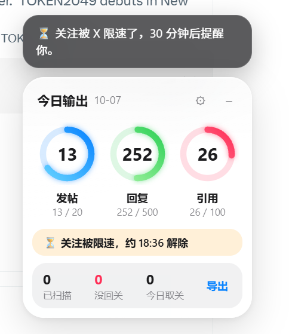
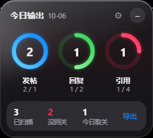

# X Daily Rings · 每日输出环

**今天发了几条、回了几条、引用了几条？挂在 X 页面上，一眼就知道。**

一个 Chrome / Edge 插件：在 X 页面放一张可以拖动的悬浮卡片，用三个圆环记录当天的发帖、回复、引用数量，目标自己定。进度到 25%、50%、75% 时冒一句鼓励，满环放彩带。顺带在你的「正在关注」页面，把没有回关你的人标出来。

[下载安装包](https://github.com/hskelp9527-pixel/x-daily-rings/releases/latest) · [反馈问题](https://github.com/hskelp9527-pixel/x-daily-rings/issues/new/choose) · [English](#english)

[](https://github.com/hskelp9527-pixel/x-daily-rings/actions/workflows/checks.yml)
[](LICENSE)

 


以上截图来自模拟页面与测试数据。

## 能做什么

- **三个圆环**：发帖、回复、引用，圆环中间是今天的数量。点 ⚙ 设目标，过了电脑上的 0 点自动清零。
- **补录手机上发的**：在电脑上打开自己主页的「回复」标签，往下滚到出现昨天的帖子，今天在手机上发的帖子、回复、引用会补进圆环。按帖子 ID 去重，不会重复计数。
- **鼓励**：每个环到 25% / 50% / 75% 冒一句话，3 秒后消失；到 100% 放彩带。
- **没回关高亮**：打开自己的「正在关注」页面往下滚，没有「关注了你」标签的人整行标红。卡片底部分开显示「已扫描」「没回关」「今日取关」，都只算今天扫描到的人，每天清零；取关后前两个数字不会减少。
- **取关计数**：取关仍然点 X 自己的按钮，插件只记下今天取关了几个。
- **关注限速提醒**：关注时被 X 限速，卡片上显示预计解除时间，30 分钟后在页面里提醒。30 分钟是经验值，X 没有公开具体规则；X 页面都关掉时不会提醒，下次打开再补。
- **悬浮卡片**：拖到哪里就停在哪里，点 – 收起成一行小字。
- **导出**：每天的数量、目标、没回关名单，导出成一个 JSON 文件。

## 会不会被当成机器人？

插件的设计原则是**只看，不动手**：

- 不调用 X API，不额外发出任何请求。计数的方式是：你自己发帖时，X 网页会收到「发布成功」的返回，插件读这份返回来判断这一条是发帖、回复还是引用；补录手机上的内容，读的是你打开主页时 X 自己加载的时间线。
- 没回关名单只读你滚动到的、页面上已经显示的内容，不自动翻页，不自动点击。
- 取关只能你自己点，没有批量取关、一键取关。

从 X 服务器的角度看，装不装插件，你发出的请求都一模一样。

## 已知限制

- 手机上和定时发送的内容，要在电脑上打开自己主页的「回复」标签才会补录，只补今天的，只补已经滚动加载出来的。
- 转帖（不加评论）不计入；编辑帖子不重复计数；删掉的帖子不会扣回。
- 回复自己的帖子（比如连续发帖串）记作发帖，不算回复。
- 依赖 X 网页的内部结构。X 改版后如果计数或高亮失效，请[提个 Issue](https://github.com/hskelp9527-pixel/x-daily-rings/issues/new/choose)。

## 安装，三步即可

目前通过开发者模式安装，尚未上架 Chrome Web Store 或 Edge Add-ons。Windows 和 macOS 上的 Chrome、Edge 都能用（Safari 不支持）。

1. 在 [Releases](https://github.com/hskelp9527-pixel/x-daily-rings/releases/latest) 下载 **x-daily-rings.zip**，解压到一个准备长期保留的文件夹。
2. Chrome 地址栏打开 `chrome://extensions`，Edge 打开 `edge://extensions`，开启「开发者模式」。
3. 点击「加载已解压的扩展程序」，选择包含 `manifest.json` 的文件夹，然后刷新已打开的 X 页面。

更新时先点卡片上的「导出」备份，再把新版本解压到同一文件夹，在扩展页面点「重新加载」并刷新 X。尽量不要卸载重装，卸载会清除本机数据。

## 隐私

所有数据只存在当前浏览器的 `chrome.storage.local`，没有服务器、没有统计、没有云同步。权限只有 `storage`；脚本只在 x.com / twitter.com 上运行。全部运行代码都在仓库里，没有第三方运行时依赖。

## 开发与验证

运行插件无需构建。测试需要 Node.js 22+：

```sh
npm ci
npm test                 # 计数分类、里程碑、日期切换
npm run test:browser     # 真实插件 + 模拟 X 页面：计数、高亮、取关、拖动、持久化
```

浏览器测试默认使用本机 Edge，也可以设置 `BROWSER_PATH`。测试使用临时浏览器资料，不登录任何账号。

打包：`python scripts/package.py`，产物在 `dist/x-daily-rings.zip`。推送 `v*` tag 时 GitHub Actions 会自动打包并发布 Release。贡献方式见 [CONTRIBUTING.md](CONTRIBUTING.md)。

同一作者的另一个 X 插件：[记得 @ · X Mention Saver](https://github.com/hskelp9527-pixel/x-mention-saver)，选中用户名即可收藏，发帖时一键复制 @。

## English

**How many posts, replies and quotes did you ship on X today? See it at a glance.**

X Daily Rings is a Chrome / Edge extension (Chinese UI) that pins a draggable card on X with three daily rings: posts, replies and quotes, each with your own goal. You get a short cheer at 25 / 50 / 75 % and confetti when a ring closes. Counts reset at local midnight. Posts made on your phone are picked up when you open your profile's Replies tab (deduplicated by tweet id). If X rate-limits a follow, the card shows when the 30-minute cooldown ends and reminds you in-page. On your own Following page it also highlights everyone who does not follow you back; unfollowing stays a manual click on X's own button, and the card counts today's unfollows.

It only reads, never acts: no X API calls and no extra requests. Counting reads the responses X's own web app receives when *you* publish or open your profile; the follow-back check reads only rows you have scrolled into view. No auto-scroll, no bulk unfollow. Data lives in `chrome.storage.local` and can be exported as JSON.

Limits: posts from other devices and scheduled posts only count once you open your profile's Replies tab; reposts and edits are not counted; deletions are not subtracted; replies to your own posts (threads) count as posts. X markup changes may break counting or highlighting until an update ships.

Install: download **x-daily-rings.zip** from [Releases](https://github.com/hskelp9527-pixel/x-daily-rings/releases/latest), unzip, enable Developer mode in `chrome://extensions` or `edge://extensions`, choose **Load unpacked**, select the folder with `manifest.json`, and refresh X.

MIT licensed. Independent project, not affiliated with X Corp.
